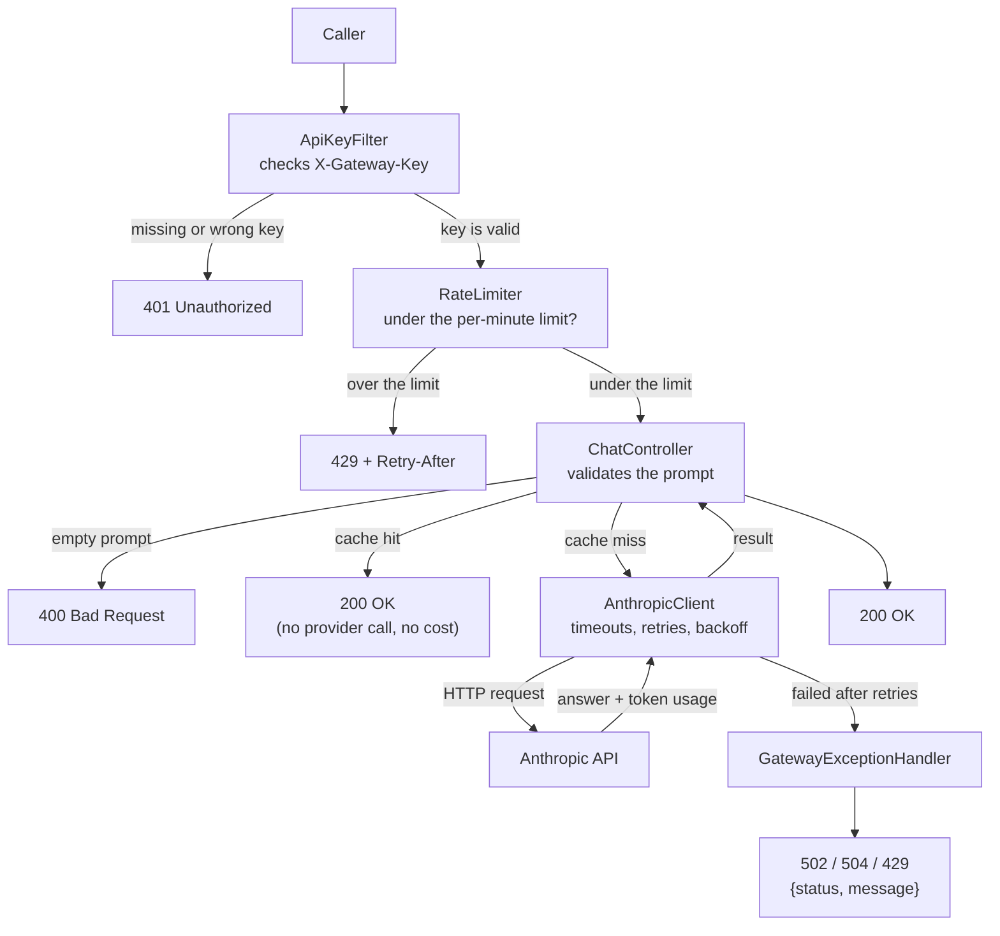

# LLM Gateway

A Spring Boot service that sits in front of a model provider's API. Applications
call the gateway; the gateway calls the model. Because every call goes through
one place, that is where the API key, retries, timeouts, rate limiting, caching
and cost tracking live — instead of being copied into every application that
wants to use a model.

Live: `https://llm-gateway-3z3j.onrender.com`
(free tier — it sleeps after 15 minutes idle, so the first request can take
about a minute)

## Why a gateway

Without one, every application that uses a model needs its own copy of the API
key, its own retry logic, and its own idea of what it is spending. Nobody can
answer "what did we spend on AI last month, and on what?"

With one:

| Problem | How the gateway solves it |
|---|---|
| The provider key is copied into five applications | One key, held here. Rotate it in one place. |
| Every app reimplements retries | Retry logic written once. |
| One buggy app burns the budget | Per-key rate limiting. |
| Nobody knows what anything cost | Per-key token and cost totals. |
| Switching providers means changing every app | The gateway's own API shape is separate from the provider's. |

## Request flow



## API

All `/v1/` endpoints require an `X-Gateway-Key` header. `/actuator/health` does
not, so the hosting platform can poll it.

### `POST /v1/chat`

```bash
curl -X POST https://llm-gateway-3z3j.onrender.com/v1/chat \
  -H "content-type: application/json" \
  -H "X-Gateway-Key: $GATEWAY_API_KEY" \
  -d '{"prompt": "In one sentence, what is a load balancer?"}'
```

```json
{"response": "A load balancer distributes incoming traffic across multiple servers."}
```

### `GET /v1/usage`

Running totals for the calling key.

```json
{"requests": 2, "inputTokens": 29, "outputTokens": 172, "estimatedCostUsd": 0.001778}
```

### `GET /actuator/health`

```json
{"status": "UP"}
```

### Errors

Every failure returns the same shape:

```json
{"status": 502, "message": "gateway is not authorized with the model provider"}
```

| Status | Meaning |
|---|---|
| 400 | The prompt was empty, or the provider rejected the request |
| 401 | Missing or invalid `X-Gateway-Key` |
| 429 | Per-key rate limit reached, or the provider rate-limited the gateway |
| 502 | The gateway is fine; the provider is not |
| 504 | The provider did not respond in time |

## Running it locally

Requires Java 21.

```bash
git clone https://github.com/dakshinabp/llm-gateway.git
cd llm-gateway

export ANTHROPIC_API_KEY='sk-ant-...'
export GATEWAY_API_KEY="$(openssl rand -hex 32)"

./gradlew bootRun
```

Or with Docker:

```bash
docker build -t llm-gateway .
docker run --rm -p 8080:8080 -e ANTHROPIC_API_KEY -e GATEWAY_API_KEY llm-gateway
```

Tests need no secrets and make no network calls:

```bash
./gradlew test
```

## Configuration

| Setting | Default | Notes |
|---|---|---|
| `ANTHROPIC_API_KEY` | — | Required. The gateway's own provider credential. |
| `GATEWAY_API_KEY` | — | Required. What callers present to the gateway. |
| `ANTHROPIC_BASE_URL` | `https://api.anthropic.com` | Overridable, which makes failure injection possible in testing. |
| `anthropic.model` | `claude-sonnet-5` | In config, not compiled in — models get retired. |
| `gateway.rate-limit-per-minute` | `10` | Per key. |
| `pricing.input-per-million` | `2.00` | USD. Prices change on the provider's schedule. |
| `pricing.output-per-million` | `10.00` | USD. |
| `cache.max-entries` | `500` | LRU eviction past this. |
| `PORT` | `8080` | Set by the hosting platform. |

No secret is ever written to a file in this repository. Configuration comes from
the environment, so the same build runs locally and in production unchanged.

## Design decisions

**Retryability is a property of the failure, not of the status code.**
A bad provider credential and a provider outage both come back to the caller as
502. If the retry loop decided by reading that status, it would retry a wrong API
key three times for nothing. So `DownstreamException` carries a `retryable` flag,
set inside `translate()` where the original cause is still visible.

Retried: timeouts, 429, 5xx. Not retried: 400, 401/403, an empty response.

**The gateway's API shape is deliberately separate from the provider's.**
`ChatRequest`/`ChatResponse` describe this service's contract.
`AnthropicRequest`/`AnthropicResponse` describe the provider's. Translation
happens inside. Adding a second provider does not change anything callers see.

**Only the fields actually used are declared.** The provider's response carries
about ten fields; this code declares `content` and `usage`. Jackson drops the
rest, so the provider can add fields without breaking the gateway.

**Provider error text is never passed through.** Upstream messages can carry
internal detail. Callers get this service's wording only.

**Timeouts are asymmetric** — 5s to connect, 30s to read. Establishing a
connection should be near-instant; generating 1024 tokens legitimately takes
time, and a tight read timeout would kill healthy requests.

**Backoff has jitter.** If many callers fail at the same instant and all retry
after exactly 500ms, they arrive together and re-break whatever recovered.
Random padding spreads them.

**Auth is checked before the rate limit.** Counting requests from unknown keys
would let anyone grow the counter map by sending invented keys.

**A cache hit records no cost.** No tokens were spent, so nothing is added to the
totals. Measured locally: 1.785s for a fresh prompt, 0.008s for the same prompt
again.

**`RateLimiter` takes an injected `Clock`.** Without it, testing that the window
resets after a minute would require sleeping for a minute — so in practice that
test never gets written, and the reset never gets tested.

## Known limitations

These are deliberate, not oversights.

1. **No overall request deadline.** Three attempts against a 30-second read
   timeout, plus backoff, is a worst case near 90 seconds for one caller.
   Per-attempt timeouts are not enough; the correct fix is a budget for the whole
   request, checked before each retry.
2. **All state is in memory.** Rate-limit counters and the cache both. Two
   instances means two of each, so the effective rate limit doubles and the cache
   hit rate halves. Redis fixes both.
3. **The cache key is the prompt alone.** Change the model and answers from the
   old one are still served. Including the model name in the key fixes it.
4. **No cache TTL and no hit-rate metric.** Hit rate is the number actually worth
   reporting.
5. **Caching a model is a tradeoff, not a free win.** The same prompt normally
   produces a slightly different answer each time; caching means everyone after
   the first gets an identical one. Appropriate for repeated factual questions,
   wrong for creative work. Production gateways make it opt-in per request.
6. **Fixed rate-limit window, not sliding.** Ten requests at 10:00:59 and ten
   more at 10:01:00 is twenty in one second, technically within the rules.
7. **Costs use `double`.** This is a spend estimate for visibility, not billing.
   Real billing would use `BigDecimal`.
8. **No circuit breaker.** Retries alone still send traffic at a provider that is
   fully down.
9. **One gateway key.** The limiter and tracker are already keyed per credential,
   so issuing more keys is configuration rather than a code change.

## Tests

```bash
./gradlew test
```

Ten tests, no secrets and no network access required.

- `RateLimiterTest` — limit enforcement, per-key isolation, and window reset via
  a controllable clock.
- `ChatEndpointTest` — 401 without a key, 400 on an empty prompt, 200 returning
  the model answer, and a cache hit proved with `verify(client, times(1))`:
  two requests, one provider call. Counting calls rather than measuring time,
  because timing is unreliable in tests.
- `UsageTrackerTest` — cost arithmetic checked against numbers verifiable by
  hand, and per-key isolation.

## Stack

Java 21, Spring Boot 4.1, Gradle, Docker, deployed on Render.
